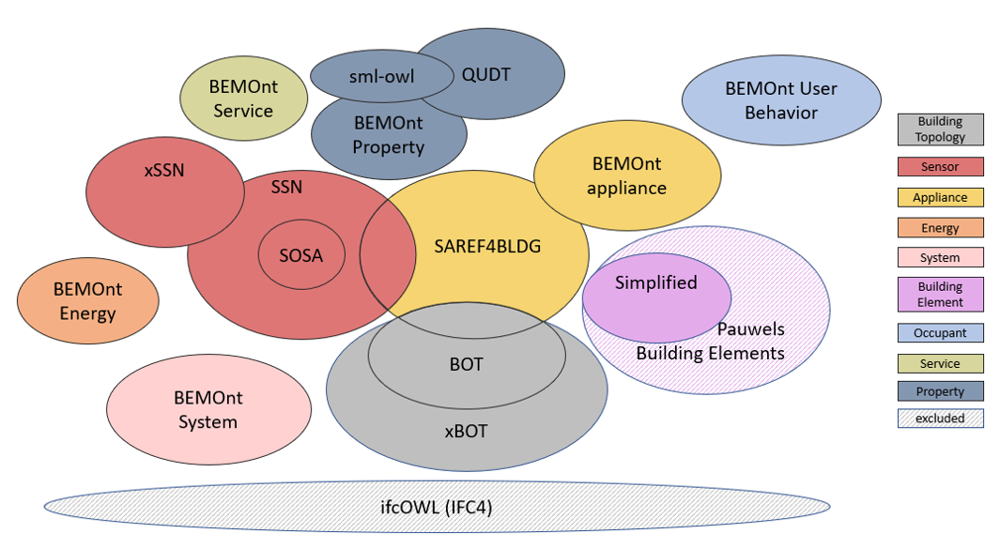

# BEMOnt (formerly HIT2GAPOnt)  refactored ontology

The refactored ontology mainly relies on well known existing ontologies (BOT, SAREF4BLDG, SSN, SOSA, BuildingElements, sml-owl and QUDT).
IfcOWL is excluded but links to its concepts are maintained in the form of rdfs:seeAlso.

The idea behind the refactored model is to be able to import only required modules to answer a particular use case. 
The modules are summarized as below:
- Building topology module: the xBOT ontology is based on BOT for describing building topology and extends it towards representing a wide set of building types (including residential and non residential buildings), spaces and storeys based on the Omniclass standard.
- Sensor module: the xSSN ontology is based on the SSN ontology to model sensors, observations, features of intereset, etc. and extends it towards representing a location of a sensor or a location of an observation made by the sensor,  observation properties, and medium types on which the measurements are performed. It also introduces a new concept xssn:Property, which generalizes ssn:Property to further represent a wider set of properties including physical and occupant properties. 
- Property module: the Property ontology imports xSSN ontology and extends it towards covering physical and occupant properties. It also imports sml-owl ontology to follow the same method proposed by the CEN comittee in defining well-known physical measures and units based on QUDT ontology
- Building appliance module: the BuildingAppliance ontology is based on SAREF4BLDG since it is the standardized ontology for representing building appliances. It extends it towards representing specific building appliances and types.
- Building Element module: The BuildingElement Ontology is based on the BuildingElement proposed by Pauwels with the exclusion of jointing component and transport element and their sublclasses. This ontology is also based on the IfcBuildingElement subtree in the IFC specification, containing a taxonomy of classes that allow to define common building elements.
- Energy module: the Energy ontology represents the different energy tarriffs, price, and renewable energy source types.
- System module: the BuildingSystem ontology represents a building energy consumption system (heating, cooling, ventilation, etc.) and its elements (boiler, chiller, radiaotor, etc.). It provides the users with the flexibility to model such systems in very simplistic or detailed way.
- Occupant module: the UserBehaviour ontology describes the occupants behaviour inside a building. It  is based on the idetification of Drivers Needs and Actions for each occupant to make underestandable the occupant-building interaction and different comfort states.
- Service module: the Services ontology is used to describe services that are client of BEMServer. Services are programs that can read/get data from BEMServer to perform specific operations, and/or push/write information on BEMServer. In some cases, services can also be seen as specific cases of sensors, producing timeseries to BEMServer. The ontology can be used to generate a catalogue of services that are installed on BEMServer.

Alignments between the different modules are also done. The below list summarizes the most important ones:
1. The sosa:FeatureOfInterest concept can represent a bot:Zone, a building element, a building device appliance, a building element and an energy concuption element;
2. The bot:Element concept generalizes sosa:Sensor, sosa:Actuator, energy:EnergyConsumptionElement, buildingelement:BuildingElement, etc.;
3. saref4bldg:BuildingSpace and saref4bldg:Building concepts overlap with bot:Space and bot:Building;
4. saref:Sensor and saref:Measurement parts overlap with sosa:Sensor and sosa:Observation;
5. xssn:Location added in xssn could be any bot:Zone.

## Authors

- **[Pierre Bourreau]()**
- **[Nathalie Charbel]()** 

